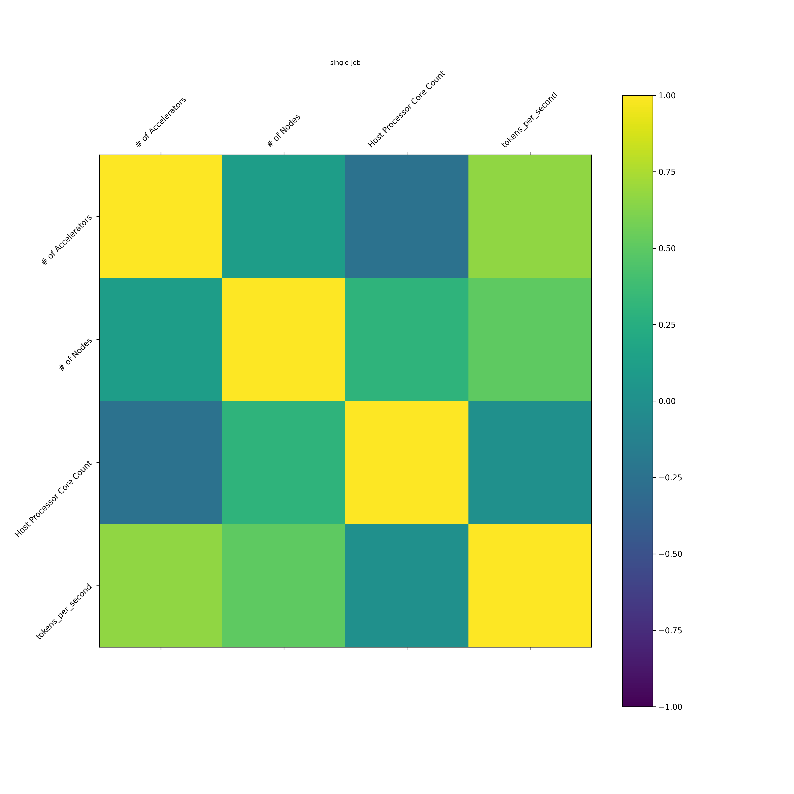

# ARISE in Action on Sample Data

To see ARISE in action on a sample dataset, we will use the [MLCommons example](../examples/MLCommons). This example
contains inference benchmark data from [MLCommons Datacenter Benchmark Results](https://mlcommons.org/benchmarks/inference-datacenter), 
where the inputs represent different configuration options of the GPU, LLM and environment, and the output is the 
measured throughput (`tokens_per_second`). We will use ARISE to help the user select the best input configurations that 
optimize throughout. Since measuring performance for the entire input space is typically not scalable and unrealistic, 
ARISE will use predictive models in order to estimate the throughout for input configurations not present in the 
benchmark data.

For example, we want to ask the following:

GGiven I am running on `gptj-99` with CPU `AMD EPYC 9654` in an `Offline` scenario, how many cores and what accelerator 
type and count do I need to achieve the best throughput for my workload?

## Generating descriptive statistics of the dataset

First, to better understand the current content of the benchmark dataset, in terms of value ranges and distributions, 
and variable correlations, you can run the `analyze-jobs` command, which generate descriptive statistics on the provided 
dataset. 

```bash
python src/main.py analyze-jobs --input-path examples/MLCommons
```

The output is written to a folder named `job-analysis` in the provided input path. `descriptive-stats.csv` file contains
general statistics about the dataset numeric inputs, such as min, max, mean and standard deviation. This file is 
accompanied by a PDF file containing box plots of same inputs, showing their ranges, distribution and outliers.   

For each output variable (in our example only `tokens_per_second`), a file named  `categorical-stats-<output_name>.csv` 
is created. For each combination of the categorical inputs, it computes the min, max, and mean of the output variable.

Finally, pearson correlations are computed between the different numeric variables. In our example, we can see that the
output `tokens_per_second` is moderately correlated (0.66) with the input `# of Accelartors`.



## Using predictive models to select best-performing configurations

After getting a glimpse into the dataset characteristics, we can get back to the question we started with: 

Given I am running on `gptj-99` with CPU `AMD EPYC 9654` in an `Offline` scenario, how many cores and what accelerator 
type and count do I need to achieve the best throughput for my workload?

Answering this question requires the existence of a predictive model trained on the dataset. We will show 
[here](#building-predictive-models-from-the-dataset) how to build such a model. For now, we will use the model 
[provided in this repo](../examples/MLCommons/ARISE-auto-models/estimator-nonlinear-XGBoost-Regressor-tokens_per_second.pkl).

Before calling the predict command that will answer this question, we need to define the subset of the configuration space
that prediction needs to explore. This space is given in a yaml configuration file. A one matching our question can be found 
[here](../config/example-demo-mlcommons-config.yaml). The config file lists the fixed and variable configuration inputs,
along with the target variable and the name of the file containing the best performing model. 

You can now run the predict command, as follows.

```bash
python src/main.py predict --input-path examples/MLCommons --config-file
config/example-demo-mlcommons-config.yaml --model-path examples/MLCommons/ARISE-auto-models
```

The prediction results are generated in `ARISE-predictions/all-predictions.csv` in the provided input path. The file can
be sorted according to `rank_tokens_per_second` column to reach the configurations with the highest throughput. Top 10 
results are shown below. We can see that the best performing configuration has 8 `NVIDIA H200-SXM-141GB-CTS` 
accelerators (denoted as `NVIDIA H200` below) and 120 cores, however reducing the number of cores down to 48 decreases 
the expected throughput by a negligible 0.1 percent. However, further reducing the number of cores to 32 has a greater 
effect on expected throughput, a reduction of around 9 percent. Switching to the next best accelerator, 
`AMD Instinct MI300X-NPS1-SPX-192GB-750W` (denoted as `AMD MI300X` below), results in a 31% decrease in throughput 
compared to the best performing configuration. Again, changing the number of cores has a negligible effect on the throughout. 

Accelerator | # of Accelerator | # of cores | tokens per second 
--- | -- | --- | --- 
NVIDIA H200 | 8 | 120 | 30157.71
NVIDIA H200 | 8 | 96 | 30145.047
NVIDIA H200 | 8 | 64 | 30125.176
NVIDIA H200 | 8 | 48 | 30110.955
NVIDIA H200 | 8 | 32 | 27404.49
AMD MI300X | 8 | 32 | 20796.46
AMD MI300X | 8 | 120 | 20722.992
AMD MI300X | 8 | 96 | 20710.326
AMD MI300X | 8 | 64 | 20682.322
AMD MI300X | 8 | 48 | 20668.10

## Building predictive models from the dataset

The `auto-build-models` command generates predictive models using the provided dataset as a training set. The purpose of 
this step is to enable predicting expected performance for different input configurations that are not present in the 
benchmark dataset.

```bash
python src/main.py auto-build-models --input-path examples/MLCommons --reread-history --config-file config/small-auto-model-search-config.yaml
```
This command trains 8 different predictive models (4 linear ones and 4 non-linear ones) and performs hyperparameter 
optimization on each of them, to find the best performing ones. The results of this command are persisted in the input 
path, in a folder named `ARISE-auto-models`. This folder contains a lot of information related to the training of the 
models, most relevant is:
1. A file named `all-star-ranking.csv`, containing for each target variable, a summary of the cross-validation results of 
each of the 8 models, and their respective ranking in terms of the following standard prediction performance metrics: 
   (a) Mean Absolute Percentage Error ([MAPE](https://en.wikipedia.org/wiki/Mean_absolute_percentage_error)) 
   (b) Normalized Root Mean Square Error ([NRMSE](https://en.wikipedia.org/wiki/Root_mean_square_deviation))
   (c) Coefficient of determination ([R2](https://en.wikipedia.org/wiki/Coefficient_of_determination))
   For example, you can see that XGBoost-Regressor is the best predictive model for `tokens_per_second` according to all 
   three metrics.
2. Cross validation results of all models on all target variables (in files starting with prefix `cv_results-`)
3. The best performing linear and non-linear models according to cross validation results, persisted as pickle (.pkl) files 
4. Predictions of the best performing models on test data not seen during cross validation, in files with the prefix
`predictions-`. This test data was obtained by putting aside 20% of the dataset provided by the user.
5. A file named `best-estimators-testset-performance-summary.csv` containing the summary of the prediction performance 
metrics of the best performing models on the test data.
    
The pickle file from item (3) of the top ranked model from item (1) (in our case 
`estimator-nonlinear-XGBoost-Regressor-tokens_per_second.pkl`) is provided as input to the predict command, as explained
[here](#using-predictive-models-to-select-best-performing-configurations).

Note that when using your built model, results might slightly differ than the shown ones, as the model building process
depends not only on the provided dataset but also on the specific environment configuration used.

